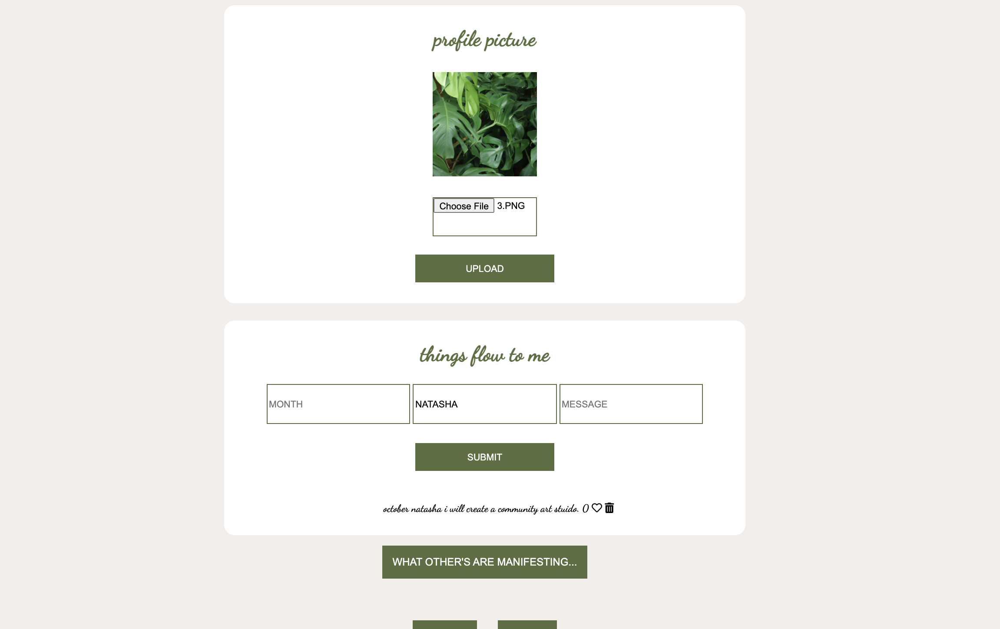

# Manifest Full Stack Application

# Description: 

Created a web application that allows users to sign-up or login to an account, upload a profile picture, add things they want to manifest to their profile, and a page that posts the manifestations of all the users who sign up for the app. Users can like other user's posts. 
# Tech Used:

 HTML, CSS, JS, API, JSON, NODE.JS, EXPRESS, MONGODB, USER AUTH